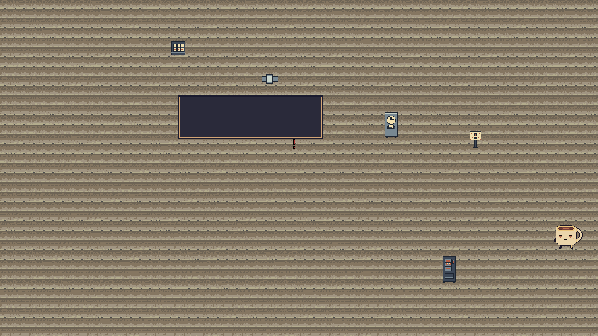
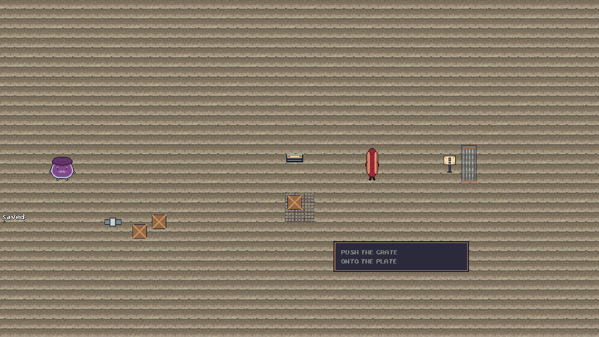
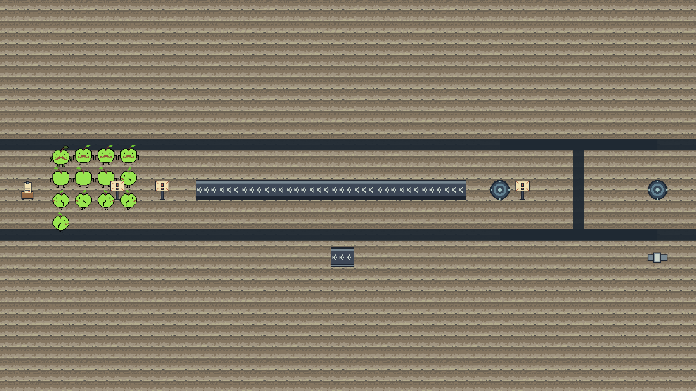
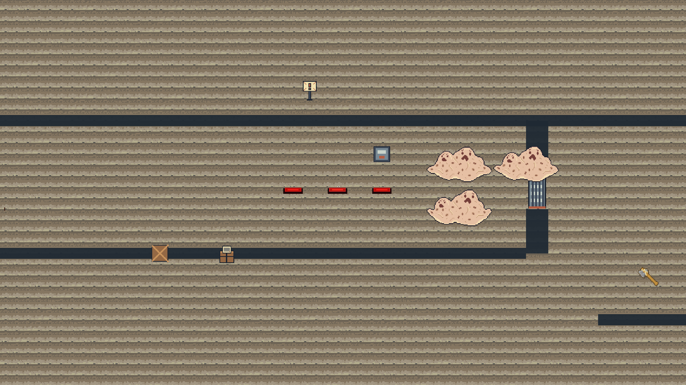
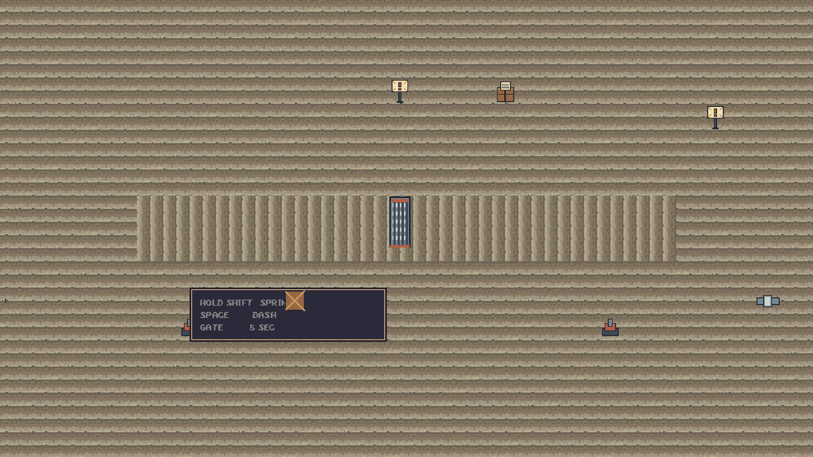

# Eggbert Authoring Guide

A hands-on manual for building content in the Godot 4.7 editor: levels, NPCs, quests, items,
music, and puzzles. Every workflow here is editor-first — you should almost never need to open
a `.tscn` or `.tres` file by hand.

**Screenshots** in this guide are real in-game renders of the shipped Factory tutorial,
captured with `godot --path . --script res://tests/ScreenshotTool.cs` (run *without*
`--headless`, which disables rendering). Editor panels are shown as annotated diagrams.

---

## 0. Tooling overview

Enable all plugins once via `Project > Project Settings > Plugins` (they ship enabled):

| Tool | Where in the editor | What it does |
| --- | --- | --- |
| **Level Assembly** | Right dock | One-click insert of transitions, puzzles, hazards, items, story triggers + **New Level…** button |
| **Level Wizard** | *(ships disabled — helper plugin)* | Its level-scaffolding UI lives in Level Assembly's **New Level…** button; enable it in Project Settings > Plugins only if you want the standalone dock |
| **Content Editors** | Right dock (Item + Quest editors) | Author **Items** and **Quests** as `.tres` without touching code |
| **Transition Audit** | Right dock | Find and fix broken switch/door/pad/transition wiring |
| Cutscene Inspector | Inspector | Card-based editing for cutscene steps and dialog trees |
| Aseprite Wizard | `Project > Tools` | Import Aseprite art as spritesheets/tilesets |

```
 ┌─────────────── LEVEL ASSEMBLY (right dock) ───────────────┐
 │ [ New Level… ]            ← scaffolds a whole level       │
 │ Search components... [___________]                        │
 │ Transitions                                               │
 │   [ Level Transition ]                                    │
 │ Puzzles        [ Door ] [ Key Door ] [ Floor Switch ] ... │
 │ Items          [ Pickup Item ] [ Conditional Item ]       │
 │ Story          [ Readable Object ] [ Cutscene Trigger ]   │
 │                [ Dialog Branch Trigger ] [ NPC (Dialog) ] │
 │ [ New Quest… ]            ← points you at Content Editors │
 └───────────────────────────────────────────────────────────┘
```

> **If docks or the bottom console ever disappear** after toggling plugins, reset the layout:
> **Editor > Editor Layout > Default**, then fully close and reopen Godot. The dock-adding
> plugins use the modern `EditorDock` + `add_dock()` API, each in its own right-hand sub-slot,
> which keeps the saved layout stable. A reset regenerates a clean layout if a corrupted one
> was ever written to disk.

---

## 1. Create a new level and draw the tilemap

1. Open the **Level Assembly** dock → click **New Level…**
2. Fill the popup:

```
 ┌── New Level ──────────────────────────────┐
 │ Level name (e.g. BoilerRoom)              │
 │ [__________________________]              │
 │ Tileset   [ factory_tileset ▼]            │
 │ Music     [ None ▼]                       │
 │ Ambience  [ None ▼]                       │
 │              [ Create ]                   │
 └───────────────────────────────────────────┘
```

1. **Create** writes `levels/<slug>/maps/<Name>.tscn` with:
   - a `Node2D` root carrying `BaseLevel.cs` (exports `LevelName`, `LevelMusic`, `LevelAmbience`)
   - two `TileMapLayer` children: `ArchitectureTilemap` (walls/floor) and `ForegroundTilemap` (overlay)
   - your chosen tileset + audio already assigned
2. **Draw the map**: select `ArchitectureTilemap`, pick tiles from the TileSet panel at the
   bottom, and paint. Rules of thumb from the shipped rooms:
   - Paint a solid wall ring around every walkable area — `LevelTileMapLayer` builds the
     invisible border collision from the *painted* region, so unpainted gaps are out of bounds.
   - Minimum comfortable room is ~1536×1024 px (the factory rooms' size).
   - Use `ForegroundTilemap` for anything the player should walk *behind*.
3. **Set the level name**: select the root node → Inspector → `LevelName`
   (e.g. `"Factory — Boiler Room"`). This drives the location banner.

> The camera bounds and map borders are automatic. You never position a Camera2D.

**What a finished room looks like** — the shipped tutorial, all five rooms:







1. **Verify**: `godot --headless --path . --script res://tests/VerifyAllLevels.cs` —
   it auto-discovers every `levels/*/maps/*.tscn`, instantiates it, and checks the tilemap +
   transition wiring. A brand-new empty room fails until you paint tiles (that's the check working).

---

## 2. NPCs and dialog

Two dialog systems:

| You want | Use |
| --- | --- |
| Simple one-off lines (a sign, a barker) | `CutsceneTrigger` with `DialogLines` |
| Multi-choice conversations (an NPC with options) | `DialogBranchTrigger` + a `DialogBranch` resource |

### A. Drop an NPC into a room

1. Open the room scene, click **Story → NPC (Dialog)** in Level Assembly
   (or instance `levels/factory/npcs/GenericFactoryWorker.tscn` — it already has a sprite,
   idle bob animation, interaction radius, and physics body).
2. Move it onto walkable floor.
3. Give it a face: expand the NPC → select `Sprite2D` → Inspector → **Texture** →
   load any `assets/characters/*.png` (Joe, Frank, GrandpaSmith, Oatmeal, Milk, Jamitor…).
4. Give it a voice: select the NPC **root** → Inspector → **Dialog Branch Path** →
   set the res:// path to a `DialogBranch` .tres, e.g. `res://levels/factory/npcs/PipDialog.tres`.
   The branch is resolved at runtime (see the gotcha below for why it's a path, not a direct resource slot).
5. Optional: `Set Flags On Fire` (e.g. `met_pip`), `Once` + `Dialog Branch Id` for one-shot scenes.

> **Gotcha — typed C# resource properties in level scenes.** The editor's import scan loads
> scenes at startup *before* the C# assembly is built. A scene that assigns a typed resource
> property directly (e.g. a `DialogBranch` resource on a `DialogBranchTrigger` inside a map)
> throws `InvalidCastException` on every editor launch. For anything placed in a map, wire
> content via string-path exports + runtime loading (`GenericFactoryWorker.DialogBranchPath`
> is the reference implementation). Direct assignment is fine inside scenes you only open
> after the editor has finished building.

### B. Author the conversation

1. In the FileSystem dock: right-click `levels/factory/npcs/` → **New Resource…** → `DialogBranch` → save as `<Npc>Dialog.tres`.
   (Or generate the skeleton with `godot --headless --path . --script res://tests/GenerateDialogBranches.cs` as a reference.)
2. Select it — the **Cutscene Inspector** renders node cards instead of a raw array:

```
 ┌── DialogBranch (Cutscene Inspector) ─────────────────────┐
 │ ┌ node: start ────────────────────────────────────┐      │
 │ │ Speaker: Pip      SetFlagsOnEnter: [met_pip]    │      │
 │ │ Lines: "Careful with that crate — ..."          │      │
 │ │ Responses:  [How do I play? → opt0]             │      │
 │ │             [Any rumors?   → opt1]              │      │
 │ │             [(Leave)      → (end)]              │      │
 │ └────────────────────────────────────[Edit]───────┘      │
 │ ┌ node: opt0 ────────────────────┐  ┌ node: opt1 ────┐   │
 │ │ Lines: "WASD to move..."       │  │ Lines: "HR's   │   │
 │ │ Responses: [(Leave) → (end)]   │  │ weird about it"│   │
 │ └───────────────[↑][↓][Remove]───┘  └────────────────┘   │
 │ [+ Add Node]                                             │
 └──────────────────────────────────────────────────────────┘
```

1. Rules:
   - An empty `Next Node Id` ends the conversation.
   - `Set Flag On Select` on a response records the player's choice (e.g. `tutorial_prefers_order`).
   - `Condition` on a node/response gates it on a WorldFlag (e.g. only show the rumor
     option after `met_jamitor`).
   - Voice is automatic — a procedural blip plays per character unless a `DialogVoiceResource` is set.

**In-game result** (Pip, Sorting Floor — see the second screenshot above):
talk with **E**, pick a response with arrows + **E**.

### C. Readable signs and posters

Instance **Story → Readable Object** (`components/npcs/ReadableObject.tscn`), then:

- `Dialog Lines` — what the player reads (shown in a speech bubble)
- `Alternate Lines` + `Gate Flag` — swap text after a story flag flips (great for the
  WANTED poster changing after the arrest)
- `Once` — one-time read, tracked as `read_<name>` in WorldFlags
- Add a `Sprite2D` child with a texture (`assets/generated/factory/warning_sign.png`,
  `manifest.png`, …) so it's visible.

---

## 3. Quests

Quests are pure data: a `QuestDefinition` resource whose objectives complete when WorldFlags flip.

1. Open the **Quest Editor** dock (Content Editors plugin):

```
 ┌── Quest Editor (right dock) ──────────────────┐
 │ Id        [fetch_the_manifest_]              │
 │ Title     [The Missing Manifest]             │
 │ Description [Crane lost the shipping mani…]  │
 │ StartFlag [met_crane]                        │
 │ Objectives                                     │
 │  [obj_1] [Find the manifest] [has_manifest] [X]│
 │  [+ Add Objective]                             │
 │ [ New Quest ] [ Save ]                         │
 │ [ Register in QuestManager ]                   │
 └────────────────────────────────────────────────┘
```

1. **Save** writes `resources/quests/<id>.tres`.
2. **Register in QuestManager** appends it to the autoload's quest list (append-only —
   existing quests are never touched). Skip this step and the quest won't exist in-game.
3. Drive it with content:
   - `StartFlag` gates when the quest becomes **Active** (set it from a dialog response
     or a `CutsceneTrigger`'s `Set Flags On Fire`).
   - Each objective completes when its `Completion Flag` becomes true — set that flag from
     a pickup (`Set Flag`), a cutscene `SetFlag` step, or a door/switch.
   - The HUD auto-pins the first active quest; `QuestManager.PinQuest(id)` overrides.

Reference implementations: `resources/quests/FactoryGateQuest.tres`, `EggsIsleOverflowQuest.tres`.

---

## 4. Items and pickups

Two registries:

| Kind | Where | How to add |
| --- | --- | --- |
| Built-in items | `components/items/ItemDatabase.cs` | Edit code (existing 40+ items live here) |
| **Editor-authored items** | `resources/items/*.tres` | **Item Editor dock** — no code, no rebuild |

### A. Create an item in the editor

1. Open the **Item Editor** dock → **New Item**.
2. Edit it in the Inspector:

```
 ┌── Item (Inspector) ─────────────────────────┐
 │ Id            factory_coffee                │
 │ Display Name  Factory Coffee                │
 │ Description   Bitter break-room coffee.     │
 │ Icon          [icon_0011.png      ] [load]  │
 │ Category      Consumable ▼   (Key/Consumable/Equipment) │
 │ Heal Amount   15                            │
 │ Slot          None ▼  (+ ATK/DEF/parry/etc. when Equipment) │
 └──────────────────────────────────────────────┘
```

1. **Save** → writes `resources/items/factory_coffee.tres`.
2. Done — `ItemDatabase.LoadExternalItems()` (runs at boot) merges the folder automatically.
   Built-in ids always win over `.tres` ids, so you can't accidentally shadow one.
   Icons: `assets/items/icons/icon_0000..0029.png`.

### B. Place it in the world

1. Level Assembly → **Items → Pickup Item** (walk-over pickup) or **Conditional Item**
   (only appears when a flag is set).
2. Inspector: `ItemId` = your item id, `Count`, optional `Dialog Lines` on pickup,
   `Set Flag` (e.g. `has_cell_key`).
3. Give it a sprite: expand → `Sprite2D` → Texture → pick an icon png.

Shipped examples: the coffee pickup by the vending machine (Opening Zone), the sandwich
behind the crate (Sorting Floor), the deviled egg in the soup alcove (Control Room).

---

## 5. Music and ambience

Per-room audio is two exports on the level root — no nodes, no code:

| Export | Behavior |
| --- | --- |
| `LevelMusic` | loops forever, 2-player cross-fade when rooms change |
| `LevelAmbience` | loops while the room is loaded, stops on exit |

1. Select the level root → Inspector → `LevelMusic` / `LevelAmbience` → load an `.ogg`.
2. Available library (`assets/audio/`):
   - **Music**: `indie_meditations/lvl_0..lvl_9_*.ogg`, `generic1.ogg`, `generic2.ogg`
   - **Ambience**: `generated/factory_afterhours_ambient.ogg`, `isle_tide_ambient.ogg`, `prison_night_ambient.ogg`
3. The tutorial's per-room assignment, as a worked example:

| Room | Music | Ambience | Why |
| --- | --- | --- | --- |
| Opening Zone | `lvl_0_the_tutorial` | `factory_afterhours` | recognizable opening theme |
| Sorting Floor | `lvl_2_the_village` | `factory_afterhours` | busier workfloor feel |
| Assembly Line | `generic1` | `factory_afterhours` | mechanical, neutral loop |
| Control Room | `lvl_1_the_royal_palace` | `factory_afterhours` | officious inspection mood |
| Loading Bay | `lvl_8_the_volcanic_sea_shore` | `prison_night_ambient` | dock at night, arrest looming |

1. Localized audio (optional): drop a `WindZone`/`ReverbZone`/`ZoneStinger` component
   (`components/audio/`) into the room for spatial atmosphere; `FootstepManager` on the
   player already varies steps by floor type.

---

## 6. Puzzles

All puzzle pieces are drag-in scenes — insert them from **Level Assembly → Puzzles/Traversal/Hazards**,
then wire two exports in the Inspector.

### The wiring model

Everything follows one pattern: an **activator** points at a **reactor** via a NodePath.

| Activator | Points at | Key exports |
| --- | --- | --- |
| Floor Switch | `Door` | `TargetDoorPath` |
| Weighted Plate | `Door` | (stays pressed while player/push-block is on it) |
| Sequence Plates ×N | `SequencePuzzleController` | `ExpectedOrder`, `TimeWindow` → controller opens the door |
| Teleport Pad | the other pad | `TargetPadPath` (place pairs) |
| Key Door | — | `RequiredFlag`, `LockedMessage` (opens when a flag is set) |
| Timed Door | — | `OpenDuration` (auto-closes) |
| Push Block | — | needs a full tile of clearance on its route |

```
   [ Floor Switch ]──TargetDoorPath──▶[ Door ]
   [ Plate A ]┐
   [ Plate B ]┼─order─▶[ SequencePuzzleController ]──▶[ InspectionDoor ]
   [ Plate C ]┘         (TimeWindow = 5s, resets on wrong order)
```

### Worked example — the Control Room sequence puzzle (screenshot above)

1. Place three `SequencePressurePlate`s (A, B, C) on the corridor floor, set their order index.
2. Add a `SequencePuzzleController` node, `TimeWindow = 5`, target = the `Door` node.
3. Place a `Door` (`components/puzzles/Door.tscn`) in the wall gap — it needs its
   `Sprite2D` + `CollisionShape2D` children (pre-configured in the scene).
4. Press **Transition Audit** → **Scan** → it lists every switch/pad/transition with a
   dropdown of valid targets:

```
 ┌── Transition Audit ────────────────────────────────┐
 │ SequenceController → target door [ InspectionDoor▼]│
 │ MaintenancePadWest → pair       [ MaintenancePadEast▼] │
 │ [ Validate ]                0 dead links found     │
 │ [ Apply wiring ]            (undoable)             │
 └─────────────────────────────────────────────────────┘
```

1. **Validate** flags empty/broken NodePaths; **Apply wiring** writes them via UndoRedo.
2. Gate progress by putting a `RequiredFlag` on the room's `LevelTransition` —
   see the flag conventions below.

---

## 7. Everything else that matters

### WorldFlag naming conventions (used by dialog, doors, quests, saves)

| Pattern | Example | Use |
| --- | --- | --- |
| `cutscene_<id>` | `cutscene_arrest` | auto-set by one-shot `CutsceneTrigger` |
| `met_<npc>` | `met_pip` | first conversation |
| `has_<item>` | `has_cell_key` | key items (set by pickups) |
| `read_<object>` | `read_warning_poster` | one-time ReadableObjects |
| `beat_/spared_/fought_<enemy>` | `spared_oatmeal` | combat outcomes |
| `visited_<level>` | `visited_courtyard` | conditional dialog |

### Save points

Drop **Progress → Save Point**, set `LocationName`. Interacting heals + saves. One per room
is the shipped pattern.

### Level transitions

**Transitions → Level Transition**. Set `Level` (target scene), `TargetTransitionName`
(the name of the *return* transition node inside the target scene — both directions must
exist or `VerifyAllLevels` fails), `Side`, `RequiredFlag` to gate progress.
The **Transition Audit** dock cross-checks both directions for you.

### Cutscenes

`Resource > New > CutsceneResource`, edit with the Cutscene Inspector's step cards
(SayDialog, MoveNpc, CameraMove, SetFlag, Fade, PromptChoice…). Fire it from a
`CutsceneTrigger` (`Mode` = OnInteract or OnEnter, `Once` + `CutsceneId`).
Reference: `levels/factory/npcs/OfficerBaconArrest.tres`.

### Verify before you commit

```bash
dotnet build                                                    # 0 errors
godot --headless --path . --script res://tests/VerifyAllLevels.cs          # all rooms load + transitions resolve
godot --headless --path . --script res://tests/VerifyFactoryExpansion.cs   # tutorial contract intact
# after editing an editor plugin (.gd), parse-check it:
godot --headless --path . --check-only --script res://addons/<plugin>/<script>.gd
```

> `godot --headless --quit` does **not** parse editor dock scripts — use `--check-only --script`.
> Godot prints `Parse Error` with a capital E, so grep case-insensitively.

### Debugging

- `` ` `` (backtick) toggles the DebugOverlay (WorldFlags, player state)
- `Ctrl+S` / `Ctrl+L` capture/load a dev save state; `Ctrl+M` opens the save-state menu
- `EGGBERT_SKIP_MENU=1` boots past the menu; `EGGBERT_LOAD_STATE=<slot>` boots into a state
- Logs: `user://logs/eggbert_YYYY-MM-DD.log` (`EGGBERT_LOG_LEVEL=debug` for verbose)

### What NOT to hand-author

| Never hand-edit | Why | Do instead |
| --- | --- | --- |
| `tile_map_data` in any `.tscn` | binary blob, one wrong byte breaks the room | paint in the editor |
| `.tres` with nested sub-resources (DialogBranch, CutsceneResource, QuestDefinition) | Godot's inline sub-resource deserialization is unreliable | Inspector / Content Editors / Cutscene Inspector |
| `uid://…` values | editor-generated | let the editor assign them |
| Typed C# resource exports set directly in map `.tscn`s (e.g. `DialogBranch = ExtResource(...)` on a trigger) | import scan runs before the C# assembly builds → `InvalidCastException` every launch | string-path export + runtime load (`GenericFactoryWorker.DialogBranchPath`) |
| another agent's/human's in-progress `.tscn` | unmergeable | coordinate first |

---

## Appendix — how the screenshots in this guide were made

```bash
godot --path . --script res://tests/ScreenshotTool.cs   # NOT --headless (rendering needs a display)
```

It instantiates each `levels/factory/maps/*.tscn`, frames a Camera2D to the tilemap bounds,
and saves 2560×1440 PNGs to `docs/AUTHORING_GUIDE/assets/shots/`. Re-run it any time you
change a room to refresh this guide's images.
